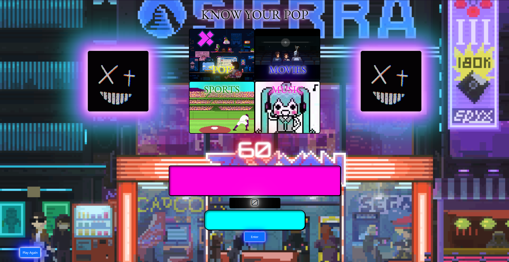

# **Know Your POP**

Know Your POP is a quiz game that test your knowledge on pop culture. The goal is simple, answer as many questions correct in a minute to increase your score, but be careful, entering the wrong spelling or wrong answer will decrease your score. If you finish with a negative score, stop touching grass and turn the TV on, otherwise congrats, I can converse with you.

[TEST YOUR POP HERE](https://know-your-pop.netlify.app)

## **Technologies used**

- CSS
- JavaScript
- HTML
- git

## **Ice Box**

- Add a high score list
- Hide the enter button
- Add enter key functionality
- Fix the CCS layout to render properly on different sized screens
- Refactor the question and asnwer arrays to an object containing key value pairs
